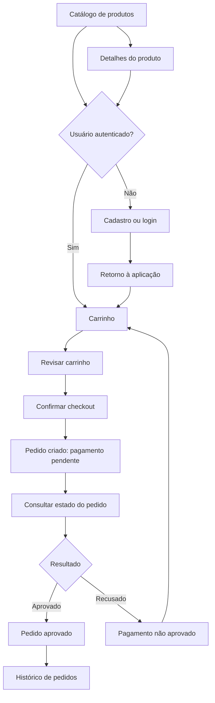
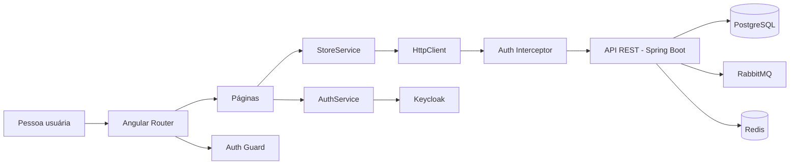
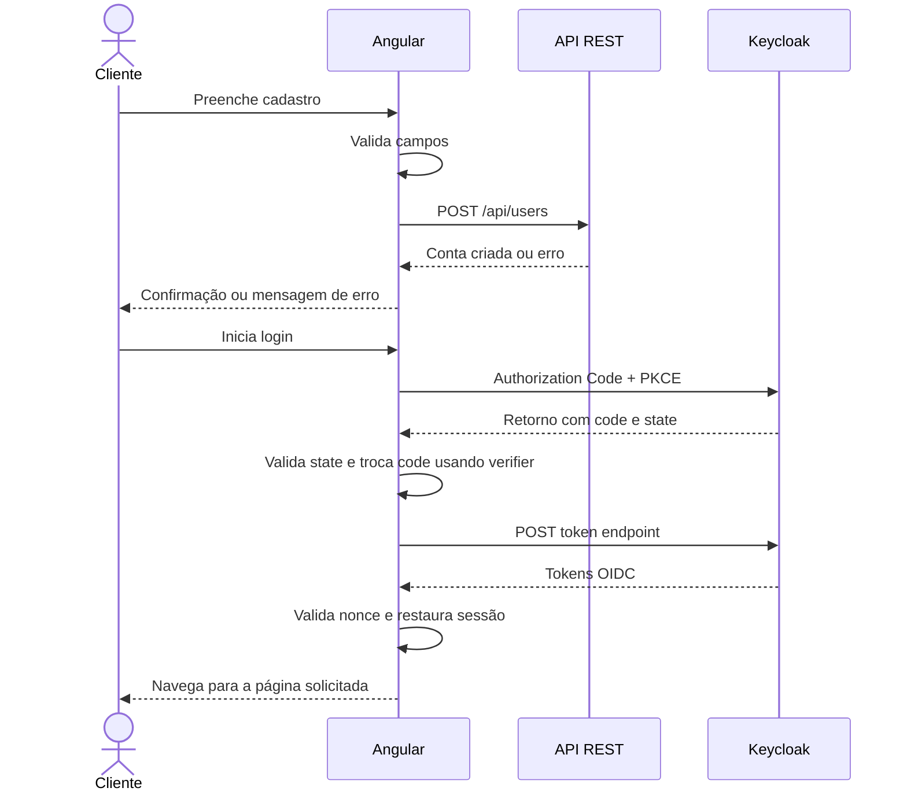
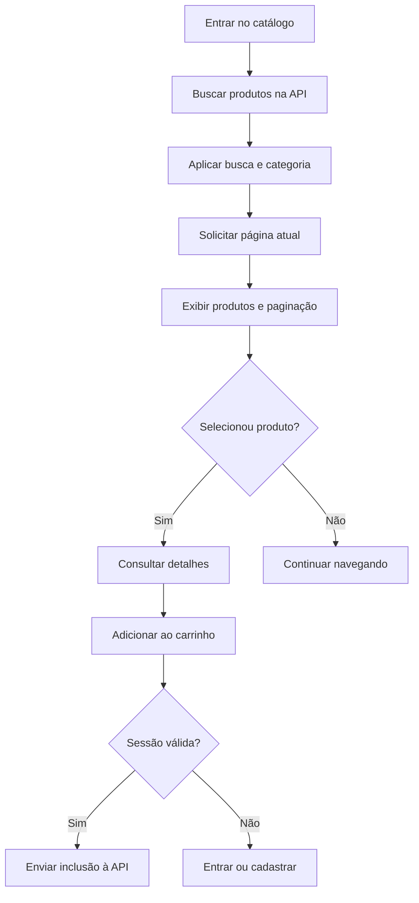
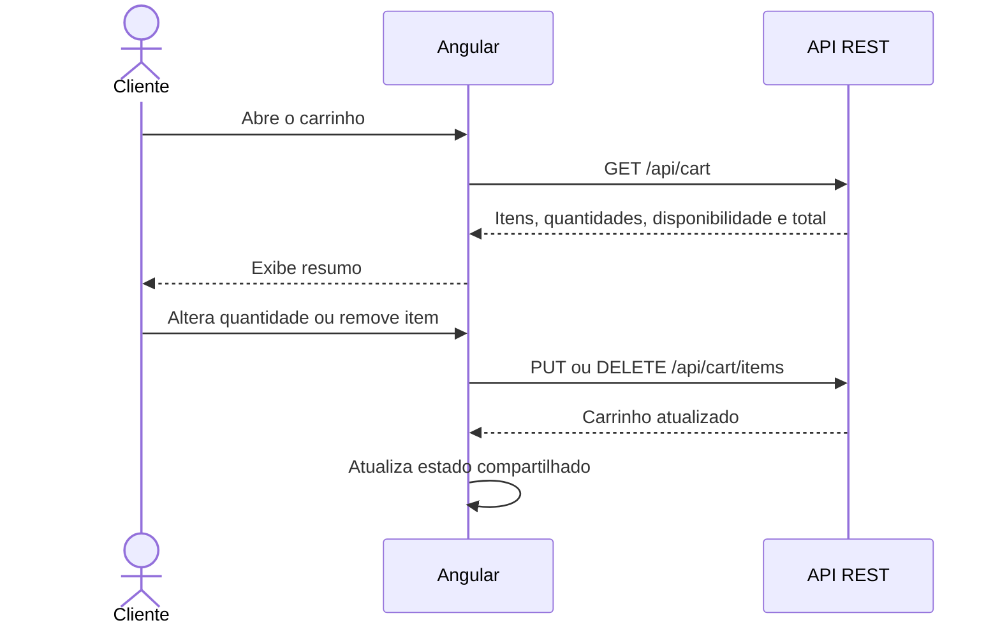
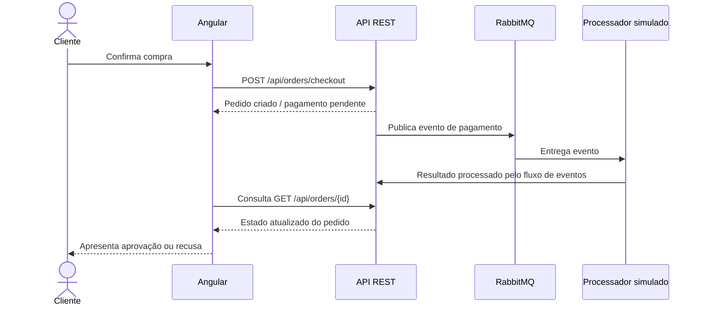

# Mercadinho — Você no Coração da Gente | Front-end

Front-end do e-commerce do supermercado **“Você no Coração da Gente”**, desenvolvido com Angular para demonstrar o fluxo de compra digital: catálogo, cadastro, autenticação, carrinho, checkout e acompanhamento de pedidos.

Este repositório corresponde à **Parte I — Construção com IA (Front-end + Cadastro)** da prova técnica. O front-end e a funcionalidade de cadastro devem ser construídos com apoio de Inteligência Artificial, e o processo precisa ser documentado de forma clara, crítica e reproduzível.

> **Importante:** o pagamento é simulado pelo back-end. O front-end não coleta dados de cartão, endereço de entrega ou frete, pois esses itens não fazem parte do escopo implementado.

## Índice

- [1. Escopo e funcionalidades](#1-escopo-e-funcionalidades)
- [2. Tecnologias](#2-tecnologias)
- [3. Arquitetura do front-end](#3-arquitetura-do-front-end)
- [4. Fluxos da aplicação](#4-fluxos-da-aplicação)
- [5. Boas práticas adotadas](#5-boas-práticas-adotadas)
- [6. Autenticação e segurança](#6-autenticação-e-segurança)
- [7. Configuração e execução](#7-configuração-e-execução)
- [8. Testes e validação](#8-testes-e-validação)
- [9. Documentação obrigatória do uso de IA — Parte I](#9-documentação-obrigatória-do-uso-de-ia--parte-i)
- [10. Entregáveis da prova técnica](#10-entregáveis-da-prova-técnica)
- [11. Limitações e decisões de escopo](#11-limitações-e-decisões-de-escopo)
- [12. Estrutura relevante do projeto](#12-estrutura-relevante-do-projeto)

---

## 1. Escopo e funcionalidades

O front-end implementa as telas e integrações necessárias para o fluxo de compra:

- **Catálogo:** listagem paginada de produtos, busca por texto e filtro por categoria.
- **Detalhes do produto:** consulta individual de produto.
- **Cadastro:** formulário com validações de nome, e-mail e senha, envio à API e mensagens de erro compreensíveis.
- **Login:** autenticação integrada ao Keycloak.
- **Carrinho:** consulta do carrinho do usuário, inclusão e remoção de itens e alteração de quantidades.
- **Checkout:** revisão do carrinho e criação do pedido.
- **Acompanhamento do pedido:** exibição do estado do pagamento e do pedido, incluindo resultado assíncrono.
- **Histórico de pedidos:** consulta paginada dos pedidos do usuário autenticado.

A identidade visual utiliza tons de azul e turquesa e ilustrações SVG locais por categoria. Como a API não fornece imagens nos DTOs de produto, as imagens apresentadas são assets locais.

### Fluxo principal



---

## 2. Tecnologias

| Tecnologia                                | Uso                                                        |
| ----------------------------------------- | ---------------------------------------------------------- |
| Angular 22                                | Componentes, páginas, roteamento e composição da aplicação |
| TypeScript 6                              | Tipagem dos contratos e lógica de interface                |
| Angular Signals                           | Estado reativo local e compartilhado em serviços           |
| Angular Reactive Forms                    | Formulários e validações                                   |
| RxJS / HttpClient                         | Comunicação HTTP e composição assíncrona                   |
| Angular Router                            | Navegação entre telas e proteção de rotas                  |
| Keycloak / OpenID Connect                 | Autenticação do usuário                                    |
| Authorization Code + PKCE                 | Fluxo de login para cliente público                        |
| Playwright                                | Testes end-to-end                                          |
| Vitest / infraestrutura Angular de testes | Testes automatizados                                       |
| Prettier                                  | Padronização de formatação                                 |

As versões exatas e os scripts de execução podem ser consultados em [`package.json`](package.json).

---

## 3. Arquitetura do front-end

A aplicação organiza a interface em páginas e concentra integrações transversais em serviços da pasta `core`.



### Responsabilidades principais

| Área                               | Responsabilidade                                                                                               |
| ---------------------------------- | -------------------------------------------------------------------------------------------------------------- |
| `src/app/pages/`                   | Componentes e templates de catálogo, produto, cadastro, login, carrinho, checkout e pedidos                    |
| `src/app/core/store.service.ts`    | Centraliza chamadas de catálogo, perfil, carrinho, checkout e pedidos; mantém estado compartilhado do carrinho |
| `src/app/core/auth.service.ts`     | Inicia e conclui o login OIDC, restaura a sessão, renova tokens e encerra a sessão                             |
| `src/app/core/auth.guard.ts`       | Redireciona usuários não autenticados para o login ao acessar rotas protegidas                                 |
| `src/app/core/auth.interceptor.ts` | Anexa o access token às chamadas destinadas à API configurada                                                  |
| `src/app/core/config.ts`           | Centraliza URL da API, URL do Keycloak, realm e client ID                                                      |
| `src/app/core/models.ts`           | Tipos usados para representar os contratos da API                                                              |
| `src/app/app.routes.ts`            | Mapeia URLs para páginas e define rotas protegidas                                                             |
| `public/images/`                   | Ilustrações SVG locais usadas na interface                                                                     |
| `e2e/`                             | Testes de fluxo no navegador com Playwright                                                                    |
| `docs/`                            | Documentação complementar, incluindo validação do ambiente                                                     |

### Rotas da aplicação

| Rota              | Acesso      | Finalidade                      |
| ----------------- | ----------- | ------------------------------- |
| `/`               | Público     | Catálogo                        |
| `/produto/:id`    | Público     | Detalhes do produto             |
| `/cadastro`       | Público     | Criar conta                     |
| `/login`          | Público     | Iniciar login                   |
| `/login/callback` | Público     | Finalizar retorno do fluxo OIDC |
| `/carrinho`       | Autenticado | Consultar e alterar o carrinho  |
| `/checkout`       | Autenticado | Confirmar compra                |
| `/pedidos`        | Autenticado | Histórico de pedidos            |
| `/pedidos/:id`    | Autenticado | Detalhes e estado de um pedido  |

A proteção no front-end melhora a navegação e a experiência, mas **não substitui a autorização no back-end**. A API deve continuar validando token, identidade, permissões e propriedade dos recursos.

---

## 4. Fluxos da aplicação

### 4.1. Cadastro e autenticação

O cadastro é enviado à API de usuários. Após a criação bem-sucedida, a aplicação encaminha a pessoa para o login. A autenticação é realizada pelo Keycloak, usando Authorization Code com PKCE.



Validações presentes no formulário de cadastro:

- Nome obrigatório, com mais de uma palavra e limite de tamanho.
- E-mail obrigatório, em formato válido e com limite de tamanho.
- Senha obrigatória, com tamanho mínimo de 8 e máximo de 128 caracteres.
- Prevenção de submissão quando o formulário é inválido ou já está enviando.
- Mensagens de erro específicas para conflitos de cadastro (`409`), dados inválidos (`400`) e falhas inesperadas.

### 4.2. Catálogo e detalhes do produto



A paginação é solicitada ao servidor; a interface não deve assumir que todos os produtos foram carregados localmente. As imagens por categoria ficam em `public/images/`:

- `public/images/acougue.svg`
- `public/images/hortifruti.svg`
- `public/images/limpeza.svg`
- `public/images/mercearia.svg`
- `public/images/padaria.svg`
- `public/images/carrinho.svg`

Exemplo de referência no Markdown para uma ilustração local:

```md

```

### 4.3. Carrinho



O servidor é a fonte de verdade para preços, estoque, totais e disponibilidade. O front-end exibe o estado retornado e trata conflitos, como estoque alterado durante a compra.

### 4.4. Checkout e pagamento assíncrono



O checkout não deve tratar a criação do pedido como aprovação imediata. A interface navega para o detalhe do pedido e acompanha o estado informado pela API. Em caso de recusa, o usuário deve receber uma mensagem clara e o carrinho deve ser recuperado conforme o estado persistido no servidor.

### 4.5. Histórico e detalhe dos pedidos

- O histórico consulta a API com paginação.
- O detalhe é consultado por identificador.
- O front-end apresenta os estados retornados pela API, sem inferir aprovação localmente.
- A autorização para acessar pedidos de uma pessoa deve ser aplicada também no back-end.

---

## 5. Boas práticas adotadas

### Separação de responsabilidades

- Componentes de página cuidam da apresentação e das interações da tela.
- `StoreService` concentra as chamadas de negócio à API e o estado compartilhado do carrinho.
- `AuthService` concentra as responsabilidades do fluxo de autenticação.
- O interceptor trata a inclusão do token nas requisições à API.
- O guard protege a navegação para páginas autenticadas.
- Os modelos TypeScript documentam e tipam os dados esperados.

### Tipagem e contratos

- Preferir tipos explícitos para dados de API em vez de `any`.
- Manter os modelos de front-end alinhados aos contratos reais do back-end.
- Tratar campos opcionais e estados de carregamento/erro sem presumir que uma resposta sempre estará completa.
- Usar o back-end como fonte de verdade para preço, estoque, totais e estado do pedido.

### Formulários e feedback

- Validar os dados no cliente para melhorar a experiência, sem considerar essa validação substituta à validação da API.
- Exibir mensagens compreensíveis e evitar apresentar detalhes internos de exceções.
- Impedir submissões repetidas enquanto uma operação está em andamento.
- Distinguir carregamento, sucesso, ausência de dados e erro.
- Limpar ou atualizar o estado visual após respostas confirmadas pelo servidor.

### Estado assíncrono e consistência

- Usar `HttpClient` e RxJS para requisições assíncronas.
- Usar Signals para estado reativo compartilhado em pontos como carrinho e autenticação.
- Evitar que uma resposta antiga de consulta sobrescreva uma alteração de carrinho mais recente; o serviço usa uma revisão interna para ignorar leituras obsoletas.
- Não assumir que o pagamento é síncrono: consultar o detalhe do pedido para exibir o estado final.
- Tratar erros de rede e conflitos de negócio, permitindo que a pessoa tente novamente quando apropriado.

### Segurança

- Utilizar Authorization Code com PKCE para autenticação do cliente público.
- Validar `state` e `nonce` durante o retorno do login.
- Encaminhar tokens apenas para a API configurada pelo interceptor, sem anexá-los indiscriminadamente a qualquer URL.
- Evitar colocar segredos de cliente ou credenciais de produção no código do front-end.
- Não registrar tokens, senhas ou dados pessoais em logs.
- Considerar o guard uma proteção de interface; autorização efetiva deve permanecer no servidor.
- Em produção, usar HTTPS e configurar URLs, CORS, redirect URIs e políticas de sessão para o ambiente correto.

> **Nota de implementação:** o `AuthService` persiste o conjunto de tokens no `sessionStorage` para restaurar a sessão na mesma aba e também mantém estado em memória. `sessionStorage` não é uma barreira contra XSS; uma evolução de segurança pode considerar uma arquitetura BFF com cookies `HttpOnly`, `Secure` e `SameSite`, conforme os requisitos do ambiente.

### Acessibilidade e responsividade

- Usar elementos semânticos e controles com nomes acessíveis.
- Manter foco visível e mensagens de validação associadas aos campos.
- Garantir que os fluxos essenciais possam ser usados em telas menores.
- Evitar comunicar status apenas por cor.
- Validar o layout em resoluções diferentes antes da entrega final.

### Manutenibilidade

- Centralizar configurações de integração em `src/app/core/config.ts`.
- Manter componentes e estilos relacionados próximos dos arquivos da página.
- Usar nomes que expressem a intenção de métodos, propriedades e testes.
- Preferir alterações pequenas e commits descritivos.
- Documentar decisões e limitações em vez de prometer funcionalidades não implementadas.

---

## 6. Autenticação e segurança

### Configuração atual de desenvolvimento

A configuração local fica em `src/app/core/config.ts`:

| Variável  | Valor padrão            |
| --------- | ----------------------- |
| API       | `http://localhost:8080` |
| Keycloak  | `http://localhost:7080` |
| Realm     | `supermercado`          |
| Client ID | `supermercado-frontend` |

Esses valores são voltados ao ambiente local. Antes de publicar ou implantar, confirme e configure os endereços do ambiente de destino. Um client ID público não é um segredo; não inclua client secrets no bundle do navegador.

### Rotas protegidas

O `authGuard` protege carrinho, checkout e pedidos. Quando não há sessão, o usuário é direcionado ao login com `returnUrl` para retomar a navegação após autenticar.

### Token nas requisições

O `authInterceptor` anexa o `Authorization: Bearer ...` apenas às requisições cuja URL começa com a URL da API configurada. O `AuthService` verifica a expiração e tenta renovar o access token quando necessário. Se a renovação falhar, a sessão local é limpa.

### Cadastro versus login

O cadastro é enviado à API (`POST /api/users`). O login é feito pelo Keycloak. Assim, o front-end não precisa armazenar nem validar senhas por conta própria depois da criação da conta.

---

## 7. Configuração e execução

### Pré-requisitos

- Node.js compatível com as ferramentas do projeto.
- npm 10.9.9, conforme o `packageManager` declarado no `package.json`.
- API do supermercado em execução.
- Keycloak, PostgreSQL, RabbitMQ e Redis ativos conforme a configuração do repositório de back-end.

### Iniciar o front-end

Na raiz deste repositório:

```bash
npm install
npm start
```

A aplicação estará disponível em:

- Front-end: `http://localhost:4200`
- API: `http://localhost:8080`
- Keycloak: `http://localhost:7080`

Use `localhost` de forma consistente, pois a origem precisa corresponder às configurações de CORS e às redirect URIs do Keycloak.

### Build de produção

```bash
npm run build
```

### Docker

Este repositório **não contém Dockerfile nem Docker Compose para o front-end**. A infraestrutura de desenvolvimento — API, PostgreSQL, Keycloak, RabbitMQ e Redis — é iniciada pelo Compose do repositório de back-end. Consulte [`docs/validacao-docker.md`](docs/validacao-docker.md) para as informações de validação local registradas.

---

## 8. Testes e validação

### Testes unitários / integração Angular

```bash
npm test -- --watch=false
```

O script `test:integration` também executa `ng test --watch=false`.

### Testes end-to-end

```bash
npm run test:e2e
```

Os testes Playwright ficam em `e2e/` e usam uma instância local do front-end na porta `4201`. A configuração define o servidor de desenvolvimento e coleta traces quando necessário.

Coberturas end-to-end existentes no repositório:

- `e2e/catalog-pagination.spec.ts`: verifica a solicitação da próxima página de produtos.
- `e2e/orders-pagination.spec.ts`: verifica a paginação do histórico de pedidos autenticado.
- `e2e/declined-payment-cart.spec.ts`: verifica a recuperação dos itens do carrinho e a contagem no cabeçalho após pagamento recusado.

Os testes de navegador simulam respostas da API para isolar o comportamento do front-end. Eles não substituem testes de integração contra o back-end real.

### Checklist de validação manual

- [ ] Catálogo carrega e permite buscar/filtrar produtos.
- [ ] Paginação consulta páginas diferentes na API.
- [ ] Cadastro valida campos e apresenta mensagens para respostas de erro.
- [ ] Login e callback OIDC funcionam com o Keycloak local.
- [ ] Uma rota protegida redireciona para login quando não há sessão.
- [ ] Inclusão, alteração e remoção de itens refletem o carrinho retornado pela API.
- [ ] Estoque indisponível ou alterado é apresentado sem confirmar compra indevidamente.
- [ ] Checkout cria pedido pendente e abre a página do pedido.
- [ ] A tela apresenta corretamente pagamento aprovado e recusado.
- [ ] Histórico e detalhe dos pedidos são carregados pela API.
- [ ] Interface é utilizável em desktop e dispositivos móveis.
- [ ] Build e testes são executados antes da entrega.

---

## 8. Estrutura relevante do projeto

```text
src/
  app/
    core/
      auth.guard.ts
      auth.interceptor.ts
      auth.service.ts
      config.ts
      models.ts
      store.service.ts
    pages/
      auth.page.css
      cart.page.css
      cart.page.html
      cart.page.ts
      catalog.page.css
      catalog.page.html
      catalog.page.ts
      checkout.page.html
      checkout.page.ts
      login.page.html
      login.page.ts
      order.page.css
      order.page.html
      order.page.ts
      orders.page.css
      orders.page.html
      orders.page.ts
      product.page.css
      product.page.html
      product.page.ts
      register.page.html
      register.page.ts
    app.routes.ts
  styles.css
public/
  images/
e2e/
docs/
  validacao-docker.md
```
